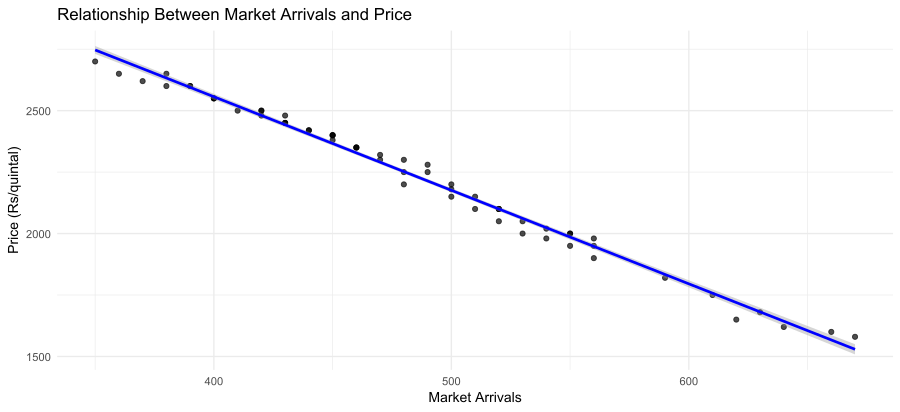
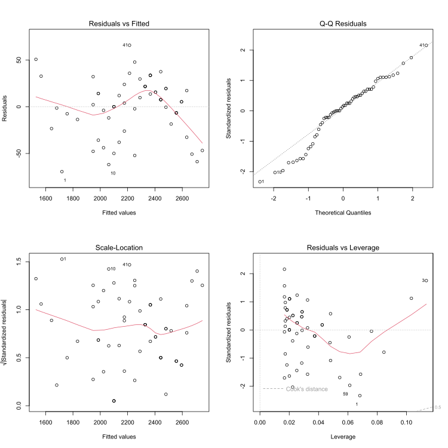

# Maize Price vs Market Arrivals Analysis

## Project Overview

This project analyzes the relationship between **maize market prices and market arrivals** using **linear regression in R**.

Agricultural commodity prices are often influenced by supply conditions. When market arrivals increase, supply in the market rises, which can lead to lower prices. This project demonstrates how **correlation analysis and regression modeling** can be used to study the relationship between supply and price in agricultural markets.

---

## Dataset

The dataset contains historical maize price and arrivals data.

| Column   | Description                        |
| -------- | ---------------------------------- |
| date     | Date of observation                |
| price    | Maize market price (₹ per quintal) |
| arrivals | Market arrivals (supply)           |

The dataset contains **60 observations**, representing monthly price and arrivals data.

---

## Tools Used

* **R**
* **RStudio**
* **ggplot2** – data visualization
* **Linear regression (lm function)** – statistical modeling

---

## Project Structure

```
maize-price-arrivals-analysis
│
├── maize_price_arrivals.csv
├── price_arrivals_analysis.R
├── price_arrivals_relationship.svg
├── regression_diagnostics.svg
└── README.md
```

---

## 1. Price vs Market Arrivals



The scatter plot shows the relationship between maize prices and market arrivals.

The regression line indicates a **strong negative relationship**, meaning that as market arrivals increase, maize prices tend to decrease.

This reflects a typical market behavior where **higher supply leads to lower prices**.

---

## 2. Regression Model

A linear regression model was estimated:

```
Price = 4078.57 − 3.81 × Arrivals
```

This means that for every **one unit increase in market arrivals**, maize price decreases by approximately **₹3.8 per quintal**.

---

## 3. Regression Diagnostics



Regression diagnostic plots were used to evaluate the model assumptions.

The plots help check:

* residual distribution
* model fit
* presence of outliers
* leverage points

---

## Methodology

The analysis followed these steps:

1. Load and inspect the dataset
2. Compute correlation between price and arrivals
3. Estimate a linear regression model
4. Visualize the relationship using scatter plots
5. Evaluate model assumptions using regression diagnostics

---

## Key Insights

### Insight 1 — Strong Negative Relationship

There is a strong negative relationship between maize prices and market arrivals.

### Insight 2 — Supply Impact on Price

Higher market arrivals increase supply in the market, which tends to push prices downward.

### Insight 3 — High Model Explanation

The regression model explains approximately **99% of the variation in maize prices**, indicating a strong relationship between arrivals and prices.

---

## How to Run the Project

1. Clone this repository

2. Open the project in **RStudio**

3. Install required packages

```r
install.packages("ggplot2")
```

4. Run the analysis script

```
price_arrivals_analysis.R
```

The script will generate all visualizations used in this analysis.

---

## Author

**Kiran Jala**
MBA Agribusiness Management

Interest areas: **Agricultural market analysis, commodity price modeling, and data analytics**
